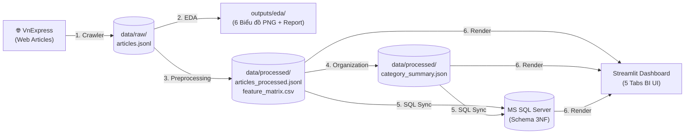

# ADY201m Project

[](https://www.python.org/)
[](src/database/schema.sql)
[](dashboard/app.py)

---

## 1. Giới thiệu Đồ án & Mục tiêu Nghiên cứu

Dự án **ADY201m — Vietnamese News Analytics & Trend Discovery Platform** tập trung hoàn toàn vào phương pháp **Phân tích Mô tả Dữ liệu (Descriptive Data Analysis)** và **Khám phá Xu hướng (Trend Discovery)** theo đúng giáo trình môn học:
- **Loại bỏ hoàn toàn Machine Learning / Mô hình Dự đoán:** Không sử dụng các mô hình phân loại phức tạp, không cần huấn luyện thuật toán hộp đen.
- **Loại bỏ NLP phức tạp:** Sử dụng các kỹ thuật thống kê tần suất từ vựng, độ phong phú ngôn ngữ và bộ lọc từ dừng (Vietnamese Stopwords) trực quan, minh bạch.
- **Tập trung vào Storytelling & Insight:** Chuyển đổi dữ liệu báo chí thô thành các báo cáo và biểu đồ xu hướng sinh động, dễ hiểu cho người dùng.

### 4 Khía cạnh Khám phá Xu hướng Trọng tâm:
1. **Xu hướng Thời gian Xuất bản (Temporal Trends):**
   - *Khung giờ vàng xuất bản:* Nhận diện các khung giờ cao điểm mà tòa soạn VnExpress phát hành tin tức nhiều nhất trong ngày.
   - *Nhịp độ phát hành theo ngày:* So sánh khối lượng tin bài giữa các ngày trong tuần (Weekday) và ngày cuối tuần (Weekend).
   - *Độ trễ thu thập (`publication_to_crawl_gap_minutes`):* Khoảng thời gian từ lúc tin bài được duyệt đăng đến khi hệ thống tiếp cận.
2. **Xu hướng Từ khóa & Chủ đề (Keyword & Topic Trends):**
   - Trích xuất top từ khóa nóng nhất (Trending keywords) trong 5 chuyên mục mục tiêu sau khi loại bỏ stopwords.
   - Phản ánh những mối quan tâm thời sự cốt lõi của xã hội trong từng lĩnh vực.
3. **Xu hướng Định dạng & Dung lượng Nội dung (Content Length Trends):**
   - Phân tích sự phân hóa về độ dài (số từ, số câu, số ký tự) giữa các chuyên mục (chuyên mục nào viết sâu, chuyên mục nào tin vắn).
   - Đánh giá độ phong phú từ vựng (`lexical_diversity`) giữa các nhóm đề tài.
4. **Xu hướng Cơ cấu Chuyên mục (Taxonomy Trends):**
   - Phân tích tỷ trọng và cơ cấu các tiểu mục (`subcategory`) bên trong từng chuyên mục chính.

### 5 Chuyên mục Tin tức Mục tiêu:
1. **Thời sự** (`thoi-su`)
2. **Kinh doanh** (`kinh-doanh`)
3. **Bất động sản** (`bat-dong-san`)
4. **Khoa học công nghệ** (`khoa-hoc-cong-nghe`)
5. **Sức khỏe** (`suc-khoe`)

---

## 2. Thành viên Thực hiện & Phân công Đề tài

| STT | Mã Sinh viên | Vai trò Cốt lõi | Phân công Nhiệm vụ Chi tiết |
| :---: | :---: | :--- | :--- |
| 1 | **HE210442** | **Cào dữ liệu & Làm sạch dữ liệu** | - Xây dựng bộ cào tự động VnExpress qua RSS & Sitemap XML ([`src/crawler/`](src/crawler/)).<br>- Kiểm định chất lượng dữ liệu thô và quản trị mã băm SHA-256 ([`src/validation/validate_raw.py`](src/validation/validate_raw.py)).<br>- Tiền xử lý, chuẩn hóa Unicode NFC và trích xuất 13 đặc trưng mô tả ([`src/preprocessing/preprocess.py`](src/preprocessing/preprocess.py)). |
| 2 | **HE210543** | **Quản lý Database** | - Thiết kế kiến trúc lược đồ CSDL quan hệ chuẩn hóa 3NF ([`src/database/schema.sql`](src/database/schema.sql)).<br>- Xây dựng pipeline nạp đồng bộ (ETL/Upsert) an toàn, chống SQL Injection ([`src/database/sync.py`](src/database/sync.py)).<br>- Quản trị kết nối ODBC, tối ưu hóa chỉ mục và viết truy vấn phân tích nâng cao với Window Functions ([`sql/queries.sql`](sql/queries.sql)). |
| 3 | **HE210370** | **Vẽ sơ đồ trực quan & Dashboard** | - Phân tích khám phá dữ liệu (EDA), phân tích xu hướng thời gian & từ vựng ([`src/eda/`](src/eda/)).<br>- Thiết kế và kết xuất 6 biểu đồ trực quan hóa dữ liệu tĩnh ([`outputs/eda/`](outputs/eda/)).<br>- Phát triển giao diện web BI Dashboard Streamlit 5 Tab tương tác ([`dashboard/app.py`](dashboard/app.py)). |

---

## 3. Luồng Chạy Dữ Liệu (Data Pipeline Flow)

Toàn bộ quy trình xử lý dữ liệu từ lúc cào tin tức từ VnExpress đến khi hiển thị trên giao diện Dashboard được thiết kế theo luồng tuần tự, khép kín và bảo toàn nguyên vẹn 100% dữ liệu gốc:



### Bảng tóm tắt các chặng luân chuyển dữ liệu:

| Chặng | Tên giai đoạn | Dữ liệu Đầu vào (Input) | Module xử lý chính | Dữ liệu Đầu ra (Output) | Vai trò trong hệ thống |
| :---: | :--- | :--- | :--- | :--- | :--- |
| **1** | **Thu thập (Ingestion)** | RSS Feeds & Sitemap VnExpress | [`src/crawler/`](src/crawler/) | `data/raw/articles.jsonl` | Bóc tách 12 trường cấu trúc dữ liệu thô, đóng băng mã băm SHA-256. |
| **2** | **Khám phá (EDA)** | `data/raw/articles.jsonl` | [`src/eda/`](src/eda/) | `outputs/eda/*.png`<br>`outputs/eda_summary/` | Đánh giá phân phối, khung giờ vàng, xuất 6 biểu đồ PNG tĩnh và báo cáo. |
| **3** | **Tiền xử lý (Cleaning)** | `data/raw/articles.jsonl` | [`src/preprocessing/`](src/preprocessing/) | `data/processed/articles_processed.jsonl`<br>`data/processed/feature_matrix.csv` | Chuẩn hóa Unicode NFC, khử tiêu đề lặp, trích xuất 13 đặc trưng mô tả. |
| **4** | **Tổ chức (Taxonomy)** | `articles_processed.jsonl` | [`src/organization/`](src/organization/) | `data/processed/category_summary.json` | Lọc stopwords tiếng Việt, gom nhóm chuyên mục, trích xuất top từ khóa nóng. |
| **5** | **Lưu trữ CSDL (Storage)** | Dữ liệu sạch `data/processed/` | [`src/database/`](src/database/) | CSDL Microsoft SQL Server (3NF) | Tạo 5 bảng chuẩn 3NF, đồng bộ Transaction an toàn, truy vấn Window Functions. |
| **6** | **Trực quan hóa (BI UI)** | Dữ liệu sạch / CSDL SQL Server | [`dashboard/`](dashboard/) | Web App: `http://localhost:8501` | Trình diễn 5 Tab tương tác: KPI, Khám phá Xu hướng, Quản lý tin, CSDL, Kiểm toán. |

---

## 4. Cấu trúc Thư mục Dự án

```text
ADY201m Project/
├── dashboard/                            # Ứng dụng BI Dashboard Streamlit
│   ├── app.py                            # Streamlit BI Dashboard trực quan hóa xu hướng
│   └── run_dashboard.py                  # Entrypoint khởi chạy nhanh Streamlit
├── data/
│   ├── processed/                        # Dữ liệu sạch sau tiền xử lý
│   │   ├── articles_processed.jsonl      # Dữ liệu JSONL kèm trường phái sinh & 13 đặc trưng
│   │   ├── category_summary.json         # Tóm tắt tổ chức chuyên mục & top từ khóa xu hướng
│   │   └── feature_matrix.csv            # Ma trận 13 đặc trưng thống kê mô tả
│   └── raw/                              # Dữ liệu cào gốc (Đóng băng)
│       ├── articles.jsonl                # 20 bản ghi gốc
│       └── crawl_log.jsonl               # Nhật ký thu thập dữ liệu
├── outputs/                              # Toàn bộ dữ liệu xuất, báo cáo, manifest, biểu đồ
│   ├── database/                         # Manifest tích hợp CSDL SQL Server
│   ├── eda/                              # 6 biểu đồ phân tích EDA (.png) & JSON kết quả
│   ├── eda_summary/                      # Tóm tắt & checklist EDA (Markdown & JSON)
│   ├── preprocessing/                    # Manifest tiền xử lý & Feature summary
│   ├── dataset_manifest.json             # Manifest SHA-256 dữ liệu thô
│   └── project_audit.json                # Báo cáo kiểm toán chất lượng toàn diện
├── sql/                                  # Kịch bản DDL/DML Microsoft SQL Server
│   ├── create_database.sql               # Tạo CSDL ADY201m
│   ├── create_tables.sql                 # Tạo 5 bảng chuẩn 3NF & chỉ mục
│   ├── upsert_article.sql                # Hợp đồng tham số hóa UPDATE/INSERT
│   └── queries.sql                       # 6 truy vấn phân tích nghiệp vụ & Window Functions
├── src/                                  # Mã nguồn chính của dự án
│   ├── crawler/                          # Bóc tách RSS, Sitemap, Bài báo VnExpress & validate
│   ├── database/                         # Kết nối pyodbc & nạp SQL Server 3NF (run_database.py)
│   ├── eda/                              # Thống kê văn bản & xu hướng thời gian (run_eda.py)
│   ├── organization/                     # Tự động tổ chức chuyên mục & xu hướng từ khóa (category_organizer.py)
│   ├── preprocessing/                    # Chuẩn hóa Unicode NFC & trích xuất đặc trưng (preprocess.py)
│   └── validation/                       # Kiểm tra chất lượng dữ liệu & Audit toàn dự án
├── tests/
│   └── test_pipeline.py                  # Bộ kiểm thử hồi quy tự động (unittest)
├── .env.example                          # Mẫu biến môi trường kết nối SQL Server
├── .gitignore                            # Cấu hình bỏ qua file nhị phân & môi trường ảo
├── Knowledge.md                          # Cơ sở tri thức chuẩn môn học ADY201m
├── requirements.txt                      # Thư viện pipeline chính (Data + SQL)
├── requirements-streamlit.txt            # Thư viện cho Dashboard Streamlit
└── README.md                             # Tài liệu hướng dẫn dự án
```

---

## 5. Chi tiết Các Giai đoạn Thực hiện (Phases 1 — 6)

### Phase 1: Thu thập Dữ liệu & Kiểm định Chất lượng
- **Bộ cào tự động:** [`src/crawler/`](src/crawler/) sử dụng RSS và Sitemap XML để phát hiện bài viết mới và bóc tách HTML chi tiết với `BeautifulSoup(..., 'lxml')`.
- **Cơ chế thu thập:** Lấy mẫu cân bằng chính xác 20 bài (4 bài x 5 chuyên mục mục tiêu).
- **Bộ lọc thông minh:**
  - Ngăn chặn triệt để việc rò rỉ tiêu đề và mô tả lặp lại ở đầu bài viết.
  - Tách tác giả dựa trên cấu trúc thẻ căn phải (`align="right"` trước `#article-end`), loại bỏ thông tin hậu kỳ (`Nhóm thiết kế:`, `Kết cấu:`, `Ảnh:`).
  - Cơ chế retry 3 lần với exponential backoff cho lỗi mạng tạm thời.
- **Kiểm định dữ liệu:** [`src/crawler/validate_raw.py`](src/crawler/validate_raw.py) và [`src/validation/create_manifest.py`](src/validation/create_manifest.py) xác thực 12 trường cấu trúc, đảm bảo không có bản ghi lỗi hay trùng lặp.

### Phase 2: Phân tích Dữ liệu Khám phá (EDA) & Xu hướng Cơ bản
- **Thống kê từ vựng:** Tính toán số ký tự, số từ, số câu, số từ độc nhất và độ dài trung bình của từ cho nội dung, tiêu đề và mô tả.
- **Phân tích xu hướng thời gian:** Tính toán chênh lệch thời gian từ lúc bài viết xuất bản đến lúc crawler thu thập (`publication_to_crawl_gap_minutes`).
- **Trực quan hóa:** Tự động xuất 6 biểu đồ đồ họa sắc nét vào thư mục [`outputs/eda/`](outputs/eda/):
  - `average_words_by_category.png` (Số từ trung bình theo chuyên mục)
  - `category_distribution.png` (Phân bố chuyên mục)
  - `category_subcategory.png` (Phân bố tiểu mục)
  - `content_length_distribution.png` (Phân phối độ dài nội dung)
  - `publication_hour.png` (Phân phối giờ xuất bản)
  - `publication_to_crawl_gap_by_category.png` (Độ trễ thu thập theo chuyên mục)

### Phase 3: Tiền xử lý Dữ liệu & Chuẩn hóa Unicode NFC
- **Chuẩn hóa văn bản:** Chuẩn hóa Unicode NFC (tránh lỗi font tiếng Việt tổ hợp), loại bỏ khoảng trắng thừa, xóa URL khỏi văn bản phái sinh mà không làm ảnh hưởng nội dung gốc.
- **Chuẩn hóa tác giả:** Tách riêng `author_clean` (ví dụ gộp `( Tổng hợp )` thành `tổng hợp`), bảo toàn nguyên trạng trường `author` thô.
- **Sinh đặc trưng mô tả:**
  - 13 đặc trưng số văn bản: số ký tự, số từ, số câu, từ độc nhất, độ đa dạng từ vựng (`lexical_diversity`), độ dài từ trung bình, đặc trưng tiêu đề/mô tả, tỷ lệ từ tiêu đề/nội dung, giờ đăng và thứ trong tuần.
  - Ma trận `feature_matrix.csv` lưu trữ sẵn sàng cho tích hợp CSDL và trực quan hóa.

### Phase 4: Khám phá Xu hướng Từ khóa & Tự động Tổ chức Chuyên mục
- **Bóc tách danh mục tự nhiên (Natural Taxonomy Extraction):**
  - Chuyên mục (`category`) và tiểu mục (`subcategory`) được bóc tách trực tiếp từ cấu trúc URL đường dẫn của VnExpress (`https://vnexpress.net/<category>/...`) kết hợp thẻ breadcrumbs.
  - Ánh xạ về 5 chuyên mục chuẩn hóa qua module [`src/organization/category_organizer.py`](src/organization/category_organizer.py).
- **Phát hiện từ khóa xu hướng không cần mô hình phức tạp:**
  - Lọc bỏ danh sách stopwords tiếng Việt phổ biến.
  - Thống kê tần suất từ vựng để tìm ra các chủ đề nóng nhất trong từng chuyên mục.
  - Xuất file tổng hợp thông minh `data/processed/category_summary.json`.

### Phase 5: Tích hợp CSDL Microsoft SQL Server Chuẩn 3NF
- **Lược đồ quan hệ chuẩn hóa 3NF:**
  - `dbo.Categories`: Bảng danh mục gốc (`category_id`, `category_code`, `category_name`, `description`).
  - `dbo.Subcategories`: Bảng tiểu mục (ràng buộc khóa ngoại về `Categories`).
  - `dbo.Authors`: Bảng tác giả (`author_id`, `author_name`, `author_code`).
  - `dbo.Articles`: Bảng lưu trữ bài viết với khóa chính `article_id` tự nhiên, khóa ngoại trỏ về chuyên mục, tiểu mục và tác giả.
  - `dbo.ArticleFeatures`: Bảng lưu 13 đặc trưng từ vựng và thời gian được tính toán từ Phase 3.
- **Tính toàn vẹn & Truy vấn Báo cáo Xu hướng:**
  - Sử dụng câu lệnh tham số hóa (Parameterized SQL) chống tấn công SQL Injection.
  - Hỗ trợ các truy vấn phân tích xu hướng với Window Functions (`ROW_NUMBER() OVER (PARTITION BY category_id ORDER BY published_at DESC)`).
  - Cơ chế đồng bộ an toàn: Kiểm tra bài viết đã tồn tại thì thực hiện `UPDATE`, nếu chưa có thì `INSERT` trong cùng Transaction.

### Phase 6: Giao diện BI Dashboard Khám phá Xu hướng (Streamlit)
- Nền tảng Dashboard tương tác gồm 5 tab chức năng:
  1. **Tổng quan (Overview):** Thống kê tổng số bài viết, tỷ lệ phân bố chuyên mục và bảng duyệt toàn bộ tin tức.
  2. **Khám phá Xu hướng & EDA (Trend Discovery):**
     - Biểu đồ khung giờ vàng xuất bản tin tức.
     - Biểu đồ nhịp điệu phát hành theo ngày trong tuần.
     - Biểu đồ top từ khóa thịnh hành theo từng chuyên mục.
     - So sánh dung lượng bài viết trung bình giữa các chuyên mục.
  3. **Quản lý & Tự động Phân loại Tin tức (Auto-Organize):** Trình duyệt tin tức theo chuyên mục, xem bài viết chi tiết và liên kết nguồn VnExpress.
  4. **CSDL SQL Server 3NF:** Khám phá cấu trúc bảng và chạy thử nghiệm trực tiếp các câu truy vấn SQL phân tích nghiệp vụ.
  5. **Kiểm toán & Tính Toàn vẹn (Audit):** Báo cáo kiểm định toàn diện chất lượng dữ liệu, mã băm SHA-256 đóng băng dữ liệu thô.

---

### Danh mục Kỹ thuật Các Module & Hàm Chi tiết

Mỗi hàm trong mã nguồn được chú thích bằng 1 dòng comment `#` súc tích; tài liệu kỹ thuật tập trung được liệt kê tại đây:

#### 1. Module Thu thập Dữ liệu (`src/crawler/`)
- [`src/crawler/crawler.py`](src/crawler/crawler.py):
  - `fetch_url(url: str, retries: int, delay: float) -> str`: Tải trang với cơ chế retry và header giả lập trình duyệt.
  - `ArticleCrawler`: Bóc tách 12 trường cấu trúc bài viết (tiêu đề, mô tả, nội dung, tác giả, thời gian xuất bản, chuyên mục, ID).
  - `RSSCrawler`: Bóc tách và quét danh sách tin bài từ luồng RSS của 5 chuyên mục mục tiêu.
  - `SitemapCrawler`: Bóc tách danh sách URL bài báo từ XML sitemap của VnExpress.
  - `main()`: Điều phối cào cân bằng 5 chuyên mục mục tiêu và lưu vào `data/raw/articles.jsonl`.
- [`src/crawler/article.py`](src/crawler/article.py):
  - `ArticleParser`: Bóc tách chi tiết cấu trúc HTML5 từng bài báo (tiêu đề `h1.title-detail`, mô tả, nội dung `article.fck_detail`, tác giả, thời gian xuất bản).
- [`src/crawler/validate_raw.py`](src/crawler/validate_raw.py):
  - `load_jsonl(path: Path) -> tuple[list[dict], list[str]]`: Tải các dòng dữ liệu JSONL và bắt lỗi cú pháp.
  - `count_empty_fields(records: list[dict]) -> Counter[str]`: Đếm số lượng trường bắt buộc bị rỗng hoặc thiếu.
  - `find_duplicate_urls(records: list[dict]) -> list[str]`: Tìm kiếm các URL bài viết xuất hiện nhiều hơn 1 lần.
  - `schema_issues(records: list[dict]) -> list[dict]`: Kiểm tra tính khớp nối của các trường so với schema mong đợi.
  - `timestamp_issues(records: list[dict], field: str) -> list[dict]`: Kiểm tra định dạng thời gian ISO 8601 hợp lệ.
  - `invalid_urls(records: list[dict]) -> list[dict]`: Xác thực các URL phải thuộc tên miền VnExpress.
  - `calculate_content_statistics(lengths: list[int]) -> dict`: Tính các chỉ số thống kê độ dài nội dung.

#### 2. Module Kiểm định Chất lượng (`src/validation/`)
- [`src/validation/create_manifest.py`](src/validation/create_manifest.py):
  - `calculate_sha256(path: Path) -> str`: Tính toán mã băm SHA-256 của toàn bộ tệp dữ liệu thô.
  - `load_records(path: Path) -> list[dict]`: Đọc danh sách bản ghi JSONL mà không thay đổi tệp gốc.
  - `inspect_schema(records: list[dict]) -> dict`: Xác thực cấu trúc schema chuẩn trên từng bản ghi.
  - `generate_manifest() -> dict`: Tạo tệp `outputs/dataset_manifest.json` ghi nhận thông tin kiểm định.
- [`src/validation/project_audit.py`](src/validation/project_audit.py):
  - `audit_content_quality(records, json_errors) -> dict`: Kiểm định chuyên sâu chất lượng bóc tách nội dung, phát hiện rò rỉ giao diện, trùng lặp và lỗi mã hóa.
  - `main() -> dict`: Chạy kiểm toán toàn diện tất cả các giai đoạn trong pipeline và xuất báo cáo `outputs/project_audit.json`.

#### 3. Module Phân tích Dữ liệu Khám phá (`src/eda/`)
- [`src/eda/text_statistics.py`](src/eda/text_statistics.py):
  - `word_count(text: str) -> int`: Đếm số từ theo phân tách khoảng trắng.
  - `sentence_count(text: str) -> int`: Đếm số câu dựa trên dấu chấm, hỏi, cảm thán.
  - `unique_word_count(text: str) -> int`: Đếm số từ độc nhất sau chuẩn hóa.
  - `average_word_length(text: str) -> float`: Tính độ dài ký tự trung bình của từ.
  - `analyze_articles(articles: list[dict]) -> dict`: Tổng hợp chỉ số thống kê từ vựng toàn tập bài viết và lưu vào `outputs/eda/text_statistics.json`.
- [`src/eda/temporal_analysis.py`](src/eda/temporal_analysis.py):
  - `parse_datetime(value: Any) -> datetime | None`: Phân tích chuỗi ISO thời gian.
  - `publication_to_crawl_gap_minutes(published, crawled) -> float | None`: Đo độ lệch phút giữa lúc xuất bản và lúc crawl.
  - `analyze_articles(articles: list[dict]) -> dict`: Tổng hợp phân bố ngày, giờ xuất bản và lưu vào `outputs/eda/temporal_analysis.json`.
- [`src/eda/deeper_eda.py`](src/eda/deeper_eda.py):
  - `analyze_category_relationships(articles: list[dict]) -> dict`: Phân tích ma trận quan hệ giữa category và subcategory.
  - `analyze_text_by_category(articles: list[dict]) -> dict`: Thống kê độ dài từ vựng phân loại theo từng chuyên mục.
  - `save_outputs(report, articles)`: Lưu báo cáo JSON, tóm tắt văn bản và sinh 6 biểu đồ PNG sắc nét vào `outputs/eda/`.
- [`src/eda/run_eda.py`](src/eda/run_eda.py):
  - `validate_eda_outputs() -> dict`: Tự kiểm tra đối soát tính toàn vẹn của 6 biểu đồ trực quan PNG và 7 tệp báo cáo thống kê EDA.
  - `main()`: Điều phối toàn bộ quy trình EDA, xuất checklist kiểm định và tóm tắt markdown `outputs/eda_summary/phase2_summary.md`. Hỗ trợ cờ `--check` để kiểm tra nhanh tính đầy đủ của kết quả mà không cần render lại biểu đồ.

#### 4. Module Tiền xử lý & Làm sạch Dữ liệu (`src/preprocessing/`)
- [`src/preprocessing/preprocess.py`](src/preprocessing/preprocess.py):
  - Hợp nhất toàn diện quy trình làm sạch văn bản, chuẩn hóa tác giả, trích xuất 13 đặc trưng mô tả và tự động kiểm định:
    - `normalize_unicode(text: str) -> str`: Chuẩn hóa văn bản sang bảng mã Unicode NFC.
    - `normalize_text(text: str) -> str`: Loại bỏ URL rác, quy chuẩn khoảng trắng và giữ nguyên dấu câu tiếng Việt.
    - `remove_leading_duplicate_blocks(content, title, description) -> str`: Khử triệt để phần tiêu đề/mô tả lặp lại ở đầu bài viết.
    - `lexical_features(text: str) -> dict`: Tính các đặc trưng thống kê từ vựng xác định.
    - `normalize_author(author: str | None) -> str | None`: Chuẩn hóa tên tác giả sang trường phái sinh `author_clean`, không ghi đè trường `author` thô.
    - `preprocess_record(record, category_map, subcategory_map) -> dict`: Tiền xử lý bài viết, tạo `processed_text`, `processed_metadata` và `features` (13 chỉ số thống kê mô tả cho CSDL).
    - `build_feature_matrix(rows) -> tuple[list[str], list[list]]`: Tạo ma trận 13 đặc trưng thống kê mô tả phục vụ trực tiếp bảng `dbo.ArticleFeatures`.
    - `validate(...) -> dict`: Tự động kiểm tra bảo đảm tính bất biến của dữ liệu gốc và xác nhận tính toàn vẹn của kết quả tiền xử lý (không dùng SHA-256).
    - `run() -> dict`: Điều phối tạo tệp `data/processed/articles_processed.jsonl` và `data/processed/feature_matrix.csv`, lưu manifest vào `outputs/preprocessing/`.
    - `main()`: Hỗ trợ chạy dòng lệnh linh hoạt qua CLI:
      - `python -m src.preprocessing.preprocess`: Chạy toàn bộ biến đổi và tự kiểm định.
      - `python -m src.preprocessing.preprocess --check`: Chỉ kiểm tra tính toàn vẹn dữ liệu đã qua tiền xử lý.

#### 5. Module Tự động Tổ chức Chuyên mục & Xu hướng Từ khóa (`src/organization/`)
- [`src/organization/category_organizer.py`](src/organization/category_organizer.py):
  - `extract_category_from_url(url: str) -> str`: Bóc tách tự nhiên tên chuyên mục chuẩn hóa từ slug URL VnExpress.
  - `organize_articles(records: list[dict]) -> dict`: Phân nhóm bài viết theo chuyên mục tương ứng.
  - `get_top_keywords(records: list[dict], top_n: int) -> list[tuple]`: Trích xuất top từ khóa xu hướng sau khi lọc bỏ stopwords tiếng Việt.
  - `compute_category_summary(records: list[dict]) -> dict`: Tính toán tỷ lệ phần trăm bài viết, số từ trung bình, tiểu mục và từ khóa đại diện.
  - `validate_summary() -> dict`: Tự động kiểm tra tính hợp lệ của tệp tổng hợp trên đĩa.
  - `main()`: Lưu cấu trúc chuyên mục vào `data/processed/category_summary.json` và hỗ trợ cờ `--check` tự kiểm định nhanh.

#### 6. Module Cơ sở Dữ liệu Microsoft SQL Server (`src/database/`)
- [`src/database/sqlserver.py`](src/database/sqlserver.py):
  - `build_connection_string() -> str`: Tự động nhận diện ODBC Driver (`ODBC Driver 18/17/13`, `SQL Server`) và instance cục bộ (`localhost\SQLEXPRESS`, `localhost`).
  - `get_connection()`: Mở kết nối `pyodbc` an toàn, tích hợp converter xử lý chuẩn kiểu dữ liệu `DATETIMEOFFSET` (-155) sang chuỗi ISO 8601.
  - `split_sql_batches(sql_text: str) -> list[str]`: Tách các khối lệnh SQL theo từ khóa batch `GO`.
  - `execute_schema(cursor) -> int`: Thi hành script DDL tạo 5 bảng chuẩn 3NF và chỉ mục tối ưu hóa.
  - `ensure_dimension(cursor, table, name, category_id)`: Trả về khóa ID hoặc tự động thêm mới bản ghi bảng chiều (`Categories`, `Subcategories`, `Authors`).
  - `import_record(cursor, record) -> bool`: Chèn bản ghi bài viết mới kèm 13 đặc trưng mô tả cho bảng `dbo.ArticleFeatures`.
  - `update_record(cursor, record) -> bool`: Cập nhật bản ghi bài viết và đặc trưng đã tồn tại bằng câu truy vấn tham số hóa an toàn (chống SQL Injection).
  - `sync_records(connection, records) -> tuple[int, int]`: Thực hiện đồng bộ hàng loạt trong 1 transaction an toàn (`commit`/`rollback`).
  - `verify_database(connection, records) -> dict`: Tự động đối soát toàn vẹn CSDL (Reconciliation), kiểm tra số lượng bản ghi (20/20), khóa ngoại mồ côi và đặc trưng mô tả.
  - `main()`: CLI hỗ trợ: `--init-schema`, `--import`, `--update`, `--sync`, `--check`.
- [`src/database/run_database.py`](src/database/run_database.py):
  - Entrypoint khởi chạy nhanh, hỗ trợ đầy đủ các cờ CLI `--sync` và `--check`.

#### 7. Giao diện BI Dashboard Streamlit (`dashboard/`)
- [`dashboard/app.py`](dashboard/app.py):
  - Ứng dụng Streamlit hiển thị 5 tab tương tác: Tổng quan, Khám phá Xu hướng & EDA, Quản lý & Phân loại Chuyên mục, CSDL SQL Server 3NF, Kiểm toán Tính toàn vẹn.
- [`dashboard/run_dashboard.py`](dashboard/run_dashboard.py):
  - Script khởi chạy nhanh tiện lợi: `python -m dashboard.run_dashboard`.

---

## 6. Hướng dẫn Cài đặt & Khởi chạy Nhanh (Setup Guide cho Người Mới)

Phần này hướng dẫn chi tiết từng bước cho người mới bắt đầu thiết lập môi trường và chạy dự án từ đầu đến cuối trên máy tính cá nhân.

### 6.1. Yêu cầu Tiên quyết (Prerequisites)
Trước khi bắt đầu, hãy đảm bảo máy tính đã cài đặt:
1. **Python 3.10 trở lên** (Khuyến nghị 3.11, 3.12, 3.13 hoặc 3.14). Tải tại [python.org](https://www.python.org/downloads/).
   *(Khi cài đặt trên Windows, nhớ tích chọn ô **"Add Python to PATH"**)*.
2. **Git** để quản lý mã nguồn. Tải tại [git-scm.com](https://git-scm.com/).
3. *(Tùy chọn)* **Microsoft SQL Server** (bản Developer hoặc Express) và **ODBC Driver 18 for SQL Server** nếu bạn muốn nạp dữ liệu vào CSDL quan hệ. Nếu chưa có SQL Server, bạn vẫn có thể chạy toàn bộ pipeline và Dashboard bình thường vì hệ thống tự động đọc dữ liệu từ tệp cục bộ.

---

### 6.2. Các Bước Cài đặt Môi trường (Environment Setup)

#### Bước 1: Tải mã nguồn về máy
Mở Terminal (hoặc PowerShell trên Windows) và chạy lệnh:
```bash
git clone https://github.com/Trunghieu2007/ADY201m-Project.git
cd ADY201m-Project
```

#### Bước 2: Khởi tạo và Kích hoạt Môi trường ảo (Virtual Environment)
Tạo môi trường ảo `.venv` độc lập để tránh xung đột thư viện:
```bash
# Tạo môi trường ảo
python -m venv .venv
```

Kích hoạt môi trường ảo:
- **Trên Windows (PowerShell):**
  ```powershell
  .venv\Scripts\Activate.ps1
  ```
  > 💡 *Mẹo xử lý lỗi trên Windows PowerShell:* Nếu gặp thông báo lỗi `cannot be loaded because running scripts is disabled on this system`, hãy chạy lệnh sau một lần để cấp quyền:
  > ```powershell
  > Set-ExecutionPolicy -Scope Process -ExecutionPolicy Bypass
  > .venv\Scripts\Activate.ps1
  > ```
- **Trên Windows (Command Prompt - cmd):**
  ```cmd
  .venv\Scripts\activate.bat
  ```
- **Trên macOS / Linux:**
  ```bash
  source .venv/bin/activate
  ```
*(Khi kích hoạt thành công, bạn sẽ thấy tiền tố `(.venv)` xuất hiện ở đầu dòng lệnh).*

#### Bước 3: Cài đặt các Thư viện Phụ thuộc (Dependencies)
Nâng cấp `pip` và cài đặt đầy đủ các gói thư viện cần thiết:
```bash
pip install --upgrade pip
pip install -r requirements.txt
pip install -r requirements-streamlit.txt
```

---

### 6.3. Hướng dẫn Khởi chạy Dự án

Bạn có 2 cách tiếp cận tùy theo nhu cầu:

#### Cách 1: Xem ngay Giao diện Dashboard (Khởi chạy Nhanh)
Dự án đã có sẵn tập dữ liệu mẫu chuẩn hóa trong thư mục `data/`. Bạn có thể mở ngay Dashboard để xem trực quan hóa mà không cần chạy lại pipeline:
```bash
streamlit run dashboard/app.py
```
*(Hoặc dùng lệnh tiện ích: `python -m dashboard.run_dashboard`)*

Trình duyệt web sẽ tự động mở tại địa chỉ: **`http://localhost:8501`**.

---

#### Cách 2: Tự chạy Lại Toàn bộ Quy trình từ A đến Z (End-to-End Pipeline)

Nếu bạn muốn trải nghiệm toàn bộ quy trình từ lúc cào tin tức đến khi hiển thị:

```bash
# 1. Thu thập tin tức mới từ VnExpress (20 bài / 5 chuyên mục)
python -m src.crawler.crawler

# 2. Kiểm định kỹ thuật dữ liệu vừa cào
python -m src.validation.validate_raw

# 3. Phân tích Khám phá Dữ liệu (EDA) & sinh 6 biểu đồ PNG
python -m src.eda.run_eda

# 4. Tiền xử lý, chuẩn hóa Unicode NFC & trích xuất 13 đặc trưng mô tả
python -m src.preprocessing.preprocess

# 5. Tự động nhóm chuyên mục & trích xuất Top từ khóa nóng
python -m src.organization.category_organizer

# 6. (Tùy chọn) Nạp và đồng bộ vào CSDL Microsoft SQL Server 3NF
# Cấu hình biến môi trường kết nối (nếu dùng SQL Server cục bộ):
# $env:ADY_SQLSERVER_SERVER = "localhost"
# $env:ADY_SQLSERVER_DATABASE = "ADY201m"
python -m src.database.run_database --sync

# 7. Khởi chạy Giao diện Streamlit BI Dashboard
streamlit run dashboard/app.py
```

---

### 6.4. Kiểm thử Hệ thống (Verification & Quality Gates)

Để đảm bảo toàn bộ mã nguồn hoạt động chính xác và không có lỗi:
```bash
# Chạy bộ unit tests tự động (22/22 tests PASS)
python -m unittest discover -s tests -v

# Chạy kiểm toán toàn diện tính toàn vẹn dữ liệu và mã băm SHA-256
python -m src.validation.project_audit
```
