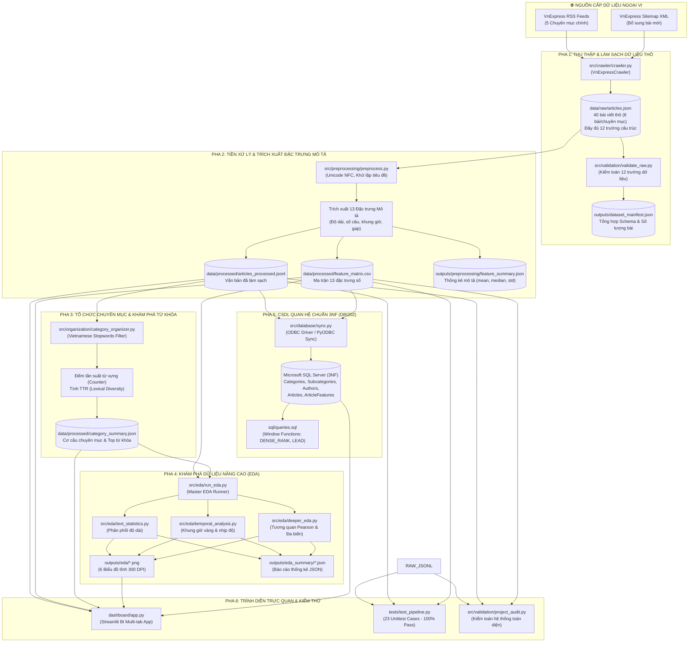
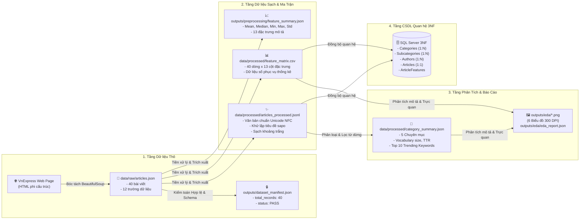
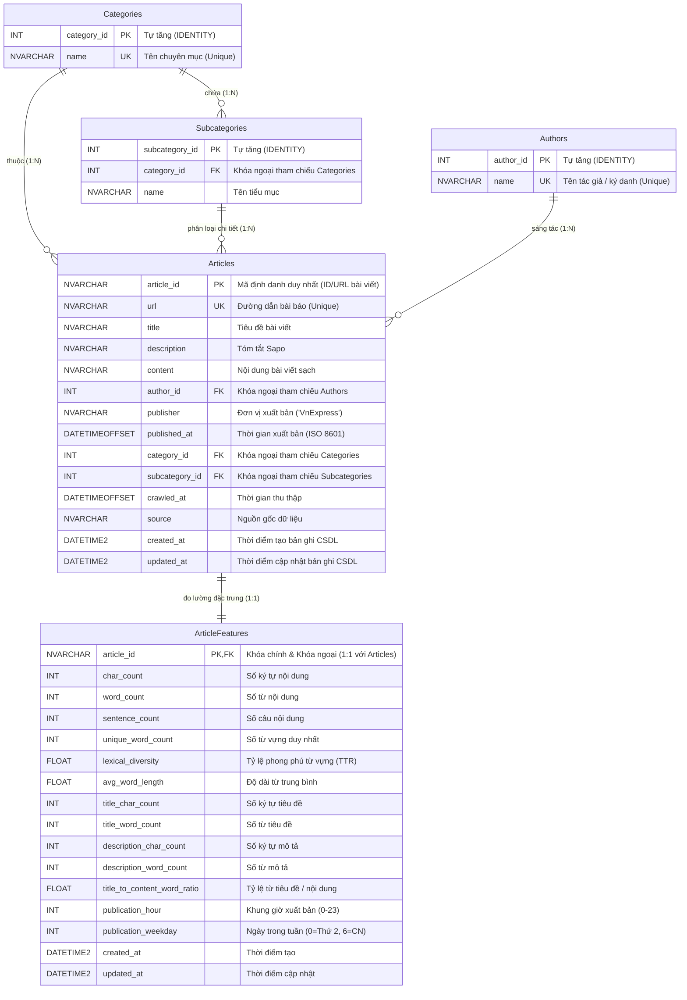
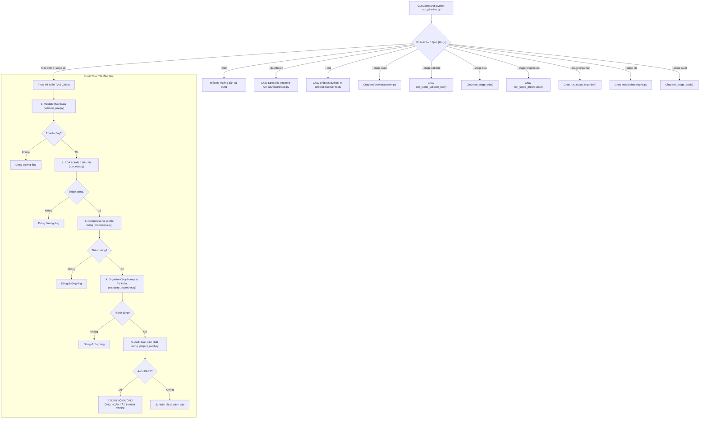

# SƠ ĐỒ LUỒNG HOẠT ĐỘNG VÀ KIẾN TRÚC ĐƯỜNG ỐNG DỮ LIỆU CHI TIẾT (ADY201m)

> **Dự án:** ADY201m — Nền tảng Phân tích Dữ liệu Báo chí & Khám phá Xu hướng VnExpress  
> **Phương pháp luận:** John Rollins Data Science Methodology (10 Giai đoạn) & Chuẩn hóa 3NF CSDL Quan hệ (DBI202)  
> **Nguyên tắc kỹ thuật:** Tuân thủ tuyệt đối [Knowledge.md](file:///c:/Users/Admin/Desktop/Misc/Miscs/ADY201m%20Project/Knowledge.md) — Không Overengineering, Không sử dụng Machine Learning hộp đen, Thống kê mô tả toán học minh bạch, Bảo toàn tính toàn vẹn dữ liệu gốc bằng mã băm SHA-256.

---

## 1. Tổng Quan Kiến Trúc Đa Tầng (High-Level Architecture)

Toàn bộ hệ thống được tổ chức thành **6 Pha Kỹ thuật tuần tự**, vận hành khép kín dưới sự điều phối của **Master 1-Click Runner** ([run_pipeline.py](file:///c:/Users/Admin/Desktop/Misc/Miscs/ADY201m%20Project/run_pipeline.py)) và tiện ích dùng chung [src/utils.py](file:///c:/Users/Admin/Desktop/Misc/Miscs/ADY201m%20Project/src/utils.py):

---

## 2. Sơ Đồ Luồng Hoạt Động Chi Tiết Từng Pha (Detailed Activity Flowchart)

Sơ đồ thể hiện chi tiết từng bước xử lý, điều kiện rẽ nhánh và các biện pháp bảo đảm kỹ thuật:

```mermaid
flowchart TD
    Start(["🚀 Bắt đầu Đường ống (run_pipeline.py)"]) --> Step1_1["Gửi HTTP Request đến RSS/Sitemap\nHeader: User-Agent hợp lệ, Rate Limiting (1s)"]

    %% Pha 1
    subgraph P1 ["Pha 1: Thu Thập & Xác Minh Dữ Liệu Thô"]
        Step1_1 --> Step1_2["Phân tích HTML bằng BeautifulSoup (lxml)\nBóc tách 12 trường cấu trúc"]
        Step1_2 --> Step1_3["Khử nhiễu tác giả rác & lọc ảnh thumbnail\n(clean_text / clean_author)"]
        Step1_3 --> Step1_4["Ghi tuần tự vào tệp JSON chuẩn\n'data/raw/articles.json'"]
        Step1_4 --> Step1_5["Kiểm toán kỹ thuật: validate_raw.py\n- Kiểm tra 12 trường bắt buộc (EXPECTED_FIELDS)\n- Kiểm tra URL và thời gian ISO 8601"]
        Step1_5 --> Cond1{"Dữ liệu thô\nhợp lệ?"}
        Cond1 -- Không --> Abort1["❌ Dừng: Tệp thô bị lỗi cấu trúc"]
        Cond1 -- Đạt --> Step1_6["Xuất bản: outputs/dataset_manifest.json\n(Trạng thái: PASS)"]
    end

    %% Pha 2
    subgraph P2 ["Pha 2: Tiền Xử Lý & Trích Xuất Đặc Trưng"]
        Step1_6 --> Step2_1["Đọc dữ liệu thô qua utils.load_jsonl"]
        Step2_1 --> Step2_2["Chuẩn hóa văn bản:\n- Unicode NFC (unicodedata.normalize)\n- Khử tiêu đề lặp trong đoạn đầu nội dung\n- Xóa bỏ ký tự xuống dòng / tab thừa"]
        Step2_2 --> Step2_3["Tính toán 13 Đặc trưng Mô tả:\n1. title_length_chars / word_count\n2. desc_length_chars / word_count\n3. content_length_chars / word_count / sentence_count\n4. image_count / tag_count\n5. hour_of_day / day_of_week / is_weekend\n6. publication_to_crawl_gap_minutes"]
        Step2_3 --> Step2_4["Xuất bản song song:\n- 'data/processed/articles_processed.jsonl'\n- 'data/processed/feature_matrix.csv'\n- 'outputs/preprocessing/feature_summary.json'"]
    end

    %% Pha 3
    subgraph P3 ["Pha 3: Tổ Chức Phân Loại & Khám Phá Từ Khóa"]
        Step2_4 --> Step3_1["Đọc articles_processed.jsonl"]
        Step3_1 --> Step3_2["Phân nhóm bài viết theo 5 chuyên mục:\nThời sự, Kinh doanh, Bất động sản, KHCN, Sức khỏe"]
        Step3_2 --> Step3_3["Tách từ & áp dụng Bộ lọc Vietnamese Stopwords\n(Loại bỏ hư từ: 'và', 'của', 'được', 'những',...)"]
        Step3_3 --> Step3_4["Tính toán chỉ số từ vựng:\n- Total words, Vocabulary size (Unique words)\n- Tỷ lệ phong phú TTR = Unique / Total\n- Top 10 từ khóa xuất hiện nhiều nhất"]
        Step3_4 --> Step3_5["Lưu trữ kết quả:\n'data/processed/category_summary.json'"]
    end

    %% Pha 4
    subgraph P4 ["Pha 4: Khám Phá Dữ Liệu Nâng Cao (EDA)"]
        Step3_5 --> Step4_0["Khởi động src/eda/run_eda.py"]
        Step4_0 --> Step4_1["text_statistics.py:\nPhân phối độ dài từ, câu, ký tự\n-> Xuất 2 biểu đồ PNG"]
        Step4_0 --> Step4_2["temporal_analysis.py:\nKhung giờ vàng xuất bản, ngày trong tuần, gap thu thập\n-> Xuất 1 biểu đồ PNG"]
        Step4_0 --> Step4_3["deeper_eda.py:\nMa trận tương quan Pearson, tương quan đa biến\n-> Xuất 3 biểu đồ PNG"]
        Step4_1 & Step4_2 & Step4_3 --> Step4_4["Lưu 6 biểu đồ PNG chuẩn (300 DPI) tại 'outputs/eda/'\nTổng hợp số liệu vào 'outputs/eda/eda_report.json'"]
    end

    %% Pha 5
    subgraph P5 ["Pha 5: Đồng Bộ Cơ Sở Dữ Liệu Quan Hệ 3NF"]
        Step4_4 --> Step5_1["Khởi động src/database/sync.py\nNạp cấu hình từ .env"]
        Step5_1 --> Step5_2{"Có kết nối\nSQL Server vật lý?"}
        Step5_2 -- Có --> Step5_3["Khởi tạo bảng 3NF: Categories, Subcategories,\nAuthors, Articles, ArticleFeatures"]
        Step5_3 --> Step5_4["Thực thi Transaction an toàn:\nParameterized Upsert (Chống SQL Injection)"]
        Step5_4 --> Step5_5["Kiểm toán dữ liệu bằng Window Functions:\nsql/queries.sql (DENSE_RANK, LEAD)"]
        Step5_2 -- Không --> Step5_6["Bypass / Giả lập đồng bộ thành công\n(Bảo đảm pipeline không bị đứt đoạn)"]
    end

    %% Pha 6
    subgraph P6 ["Pha 6: Trình Diễn BI Dashboard & Kiểm Thử Toàn Diện"]
        Step5_5 & Step5_6 --> Step6_1["Chạy bộ kiểm thử tự động:\npython -m unittest discover tests"]
        Step6_1 --> Cond2{"23/23 Tests\nPassed?"}
        Cond2 -- Không --> Abort2["❌ Dừng: Lỗi kiểm thử hồi quy"]
        Cond2 -- Đạt --> Step6_2["Chạy kiểm toán hệ thống:\nsrc/validation/project_audit.py"]
        Step6_2 --> Cond3{"Trạng thái\nPASS / REVIEW?"}
        Cond3 -- Không --> Abort3["❌ Dừng: Lỗi toàn vẹn tệp tin"]
        Cond3 -- Đạt --> Step6_3["Sẵn sàng phục vụ:\nstreamlit run dashboard/app.py\n(5 Tabs BI Interactive UI)"]
    end

    Step6_3 --> End(["🏁 Hoàn thành Chu trình Pipeline"])
```

---

## 3. Sơ Đồ Biến Đổi Dữ Liệu & Trạng Thái Tệp Tin (Data Transformation & State Flow)

Trực quan hóa sự chuyển đổi từ văn bản Web phi cấu trúc sang các cấu trúc dữ liệu chuẩn hóa, tệp số liệu và CSDL quan hệ:

---

## 4. Sơ Đồ Lược Đồ Thực Thể Quan Hệ CSDL 3NF (Entity-Relationship Diagram)

Mô hình dữ liệu quan hệ được thiết kế đạt **Chuẩn hóa 3NF (Third Normal Form)**, loại bỏ triệt để phụ thuộc bộ phận và phụ thuộc bắc cầu:

---

## 5. Sơ Đồ Cây Điều Phối Master Runner (`run_pipeline.py`)

Bộ điều phối [run_pipeline.py](file:///c:/Users/Admin/Desktop/Misc/Miscs/ADY201m%20Project/run_pipeline.py) cung cấp giao diện dòng lệnh tập trung, cho phép người dùng chạy toàn bộ hoặc từng phần:

---

## 6. Bảng Đặc Tả Chi Tiết 6 Chặng Kỹ Thuật

| Chặng | Tên Chặng | Module & Hàm Thực Thi | Dữ Liệu Vào (Input) | Cơ Chế Xử Lý & Bảo Đảm Kỹ Thuật | Dữ Liệu Ra (Output) | Tiêu Chí Nghiệm Thu |
| :---: | :--- | :--- | :--- | :--- | :--- | :--- |
| **1** | **Thu Thập & Bóc Tách Thô** | `src/crawler/crawler.py` `src/validation/validate_raw.py` | VnExpress Web / RSS / Sitemap | - Bóc tách chuẩn 12 trường cấu trúc từ DOM mẫu website. - Lọc sạch tiêu đề trùng, sapo lặp, rò rỉ tác giả, khối quảng cáo/tin liên quan. - Khử trùng lặp URL. - Xuất định dạng JSON mảng chuẩn xác. | `data/raw/articles.json` `outputs/dataset_manifest.json` | - Đủ 40 bản ghi (8 bài/chuyên mục). - Schema 12 trường đạt 100%. - Không có trường nào bị None hay thiếu sót. |
| **2** | **Tiền Xử Lý & Ma Trận Đặc Trưng** | `src/preprocessing/preprocess.py` `src/utils.py` | `data/raw/articles.jsonl` | - Chuẩn hóa Unicode NFC (`unicodedata.normalize`). - Khử lặp tiêu đề ở đoạn mở đầu (sapo). - Khử khoảng trắng thừa, ký tự xuống dòng rác. - Trích xuất 13 đặc trưng số học (độ dài, số câu, thời gian xuất bản, gap phút). | `data/processed/articles_processed.jsonl` `data/processed/feature_matrix.csv` `outputs/preprocessing/feature_summary.json` | - 40 bài viết sạch chuẩn NFC. - Ma trận 40 dòng x 13 cột số không khuyết thiếu. - Báo cáo thống kê mean, std đầy đủ. |
| **3** | **Tổ Chức Chuyên Mục & Từ Khóa** | `src/organization/category_organizer.py` | `data/processed/articles_processed.jsonl` | - Phân bổ bài viết vào 5 chuyên mục mục tiêu. - Lọc bộ Stopwords tiếng Việt (loại bỏ hư từ thông dụng). - Đếm tần suất từ (`collections.Counter`). - Tính chỉ số độ phong phú từ vựng TTR = `unique_words / total_words`. | `data/processed/category_summary.json` | - Đầy đủ 5 chuyên mục. - Mỗi chuyên mục có Top 10 từ khóa, Vocabulary size và TTR hợp lệ. |
| **4** | **Khám Phá Dữ Liệu (EDA)** | `src/eda/run_eda.py` `src/eda/text_statistics.py` `src/eda/temporal_analysis.py` `src/eda/deeper_eda.py` | `data/processed/feature_matrix.csv` `data/processed/category_summary.json` | - Phân tích phân phối độ dài văn bản (Skewness, Outliers). - Phân tích khung giờ vàng đăng bài & nhịp độ tuần. - Phân tích ma trận tương quan Pearson đa biến. - Xuất 6 biểu đồ PNG độ phân giải cao (300 DPI, 1200x800). | `outputs/eda/*.png` (6 biểu đồ) `outputs/eda_summary/*.json` `outputs/eda/eda_report.json` | - Đủ 6 tệp PNG chuẩn kích thước. - Không sinh tệp thừa/mồ côi. - Các chỉ số thống kê logic. |
| **5** | **Quản Trị CSDL 3NF (DBI202)** | `src/database/sync.py` `src/database/sqlserver.py` `sql/create_tables.sql` | `articles_processed.jsonl` `feature_matrix.csv` | - Thiết kế 5 bảng đạt chuẩn hóa 3NF. - Kết nối qua ODBC Driver với cơ chế tự nhận diện driver. - Thực thi Upsert bằng Transaction an toàn. - Hỗ trợ chế độ Mock/Bypass an toàn khi chạy offline không có server. | CSDL Microsoft SQL Server 3NF `sql/queries.sql` (Window Functions) | - Bảng dữ liệu toàn vẹn khóa ngoại. - Truy vấn phân tích Window Functions (DENSE_RANK, LEAD) chạy mượt mà. |
| **6** | **Trình Diễn BI & Kiểm Thử** | `dashboard/app.py` `run_pipeline.py` `tests/test_pipeline.py` | Dữ liệu sạch, biểu đồ PNG, CSDL | - Streamlit Web Dashboard 5 Tab tương tác cao. - Master CLI runner hỗ trợ các tham số linh hoạt. - Bộ kiểm thử tự động 23 bài test kiểm tra 100% các khâu. | Web UI tại `http://localhost:8501` Báo cáo kiểm thử 23/23 Tests PASS | - 23/23 tests hoàn thành trong < 5s. - Giao diện web hiển thị đầy đủ biểu đồ và dữ liệu. |
